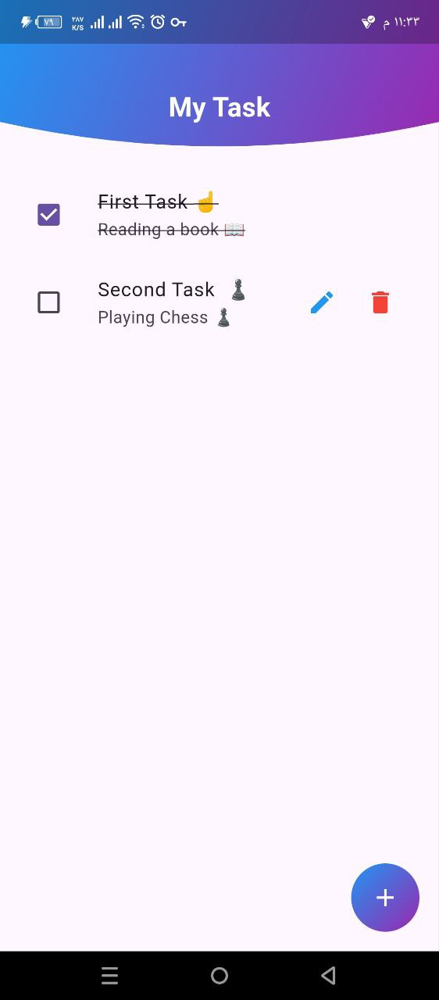
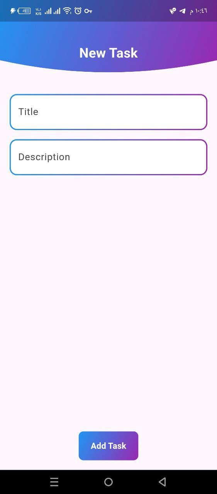

# 📝 Flutter To-Do App with Cubit & Hive

A clean and stylish task management app built using **Flutter**, **Cubit (Bloc)** for state management, and **Hive** for local data storage.

## 🚀 Features

- 🗂 Add, edit, and delete tasks
- ✅ Mark tasks as done
- 🧠 Cubit state management
- 💾 Local data persistence using Hive
- 🎨 Gradient custom AppBar and buttons
- 📱 Responsive and beautiful UI

---

## 📸 Screenshots
<table>
<tr>
<td></td>
<td></td>
</tr>
</table>

---

## 🛠 Technologies Used

- **Flutter**
- **Cubit (flutter_bloc)**
- **Hive (local NoSQL DB)**
- **Provider (optional for service injection)**
- **Material UI + Gradients**

---

## 📁 Project Structure
 <div>
lib/
├── core/
│ └── constants.dart
├── data/
│ └── models/
│ └── todo_model.dart
│ └── sources/
│ └── local_data_source.dart
├── logic/
│ └── blocs/
│ └── todo_cubit.dart
│ └── todo_state.dart
├── presentation/
│ └── screens/
│ ├── home_screen.dart
│ └── add_task_screen.dart
│ └── widgets/
│ ├── todo_tile.dart
│ ├── custom_app_bar.dart
│ └── gradient_text_field.dart
main.dart
</div>
---

## 🧑‍💻 Getting Started

### Prerequisites

- Flutter SDK
- Dart
- Hive

### Install Dependencies

```bash
flutter pub get
```
### 🤝 Contributing
Feel free to fork, improve, and open a PR.